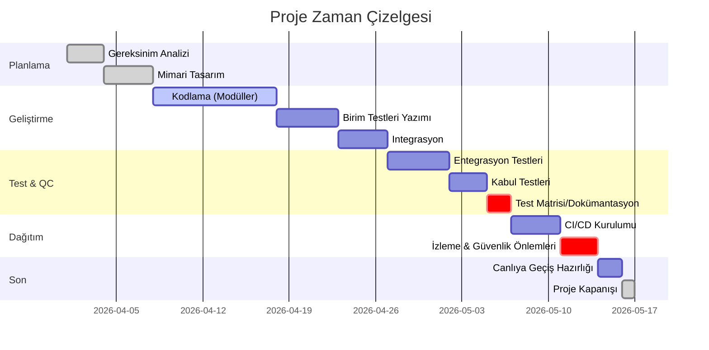

# Yönetici Özeti  
Elimizdeki metin, bir yazılım çözümü geliştirme görev tanımını içeriyor. Amacı, verilen “Sorun Tanımı”, “Hedef Kitle”, “Fırsat Fikri” ve “Aciliyet Seviyesi” alanlarından oluşan JSON formatında bir çıktı üretmektir. Bu kapsamda gerçekleştirilecek çalışmalar; gereksinim analizi, sistem tasarımı, modüler yazılım geliştirme, birim ve entegrasyon testleri, CI/CD kurulumu ve teslimat, izleme/geri dönüş mekanizmaları oluşturulması gibi aşamaları içerir. Çözüm Python diliyle, `main.py` üzerinden bağımsız modülleri çağırarak JSON çıktısı üretecek şekilde planlanacaktır. Aşağıda, projenin tüm aşamalarını, gereksinimleri ve süreci detaylı şekilde ele alan kapsamlı bir uygulama planı sunulmuştur.    

## Metnin Amacı ve Hedef Çıktılar  
Metin, kıdemli bir Yazılım Mimarı ve Veri Mühendisinin yönlendirmesi olarak ele alınmalıdır.  Ana amaç, verilen örnek JSON şemasına uygun bir yazılım ürününün geliştirilmesidir. Hedef çıktılar: kullanıcının girdiği “Sorun Tanımı”na dayanarak JSON formatında; ilgili **Sorun_Tanimi**, **Hedef_Kitle**, **Firsat_Fikri** ve **Aciliyet_Seviyesi** (Düşük/Orta/Yüksek) alanlarını üretebilen bir uygulamadır. Bu çıktılar, metindeki şema kurallarına uygun olmalı; örneğin “Sorun_Tanimi” açıklayıcı bir metin, “Aciliyet_Seviyesi” ise belirtilen üç kategoriden biri olmalıdır. Kullanıcı girdisi olarak muhtemelen doğal dilde bir şikayet veya ihtiyaç tanımı beklendiği varsayılmıştır (orijinal metinde belirtilmemiştir). Çıktı, şema tanımına uygun iyi biçimlendirilmiş bir JSON dosyası veya string’i olacaktır. Gereksinimler açıkça belirtilmediği için kod, test, dağıtım vb. tüm aşamalarda varsayımlar oluşturulmuştur.  

**Varsayımlar:** Proje kapsamı, giriş formatı (metin), performans gereksinimleri, güvenlik ve dağıtım hedefleri açıkça tanımlanmamıştır. Bu nedenle; girişin kullanıcı tarafından sağlanan düz metin olduğu, çıktı olarak JSON döndürüleceği, teknik altyapı olarak Python kullanılacağı, sınırlı bütçe ve 2–3 kişilik bir geliştirme ekibi varsayılmıştır. 

## Gerekli Kaynaklar ve Veri Formatları  
- **Teknik Kaynaklar:** Python 3.x çalışma ortamı, JSON işleme kütüphaneleri (`json`), doğal dil işleme veya model entegrasyonu için OpenAI API (veya benzeri bir dil modeli servisi) kullanılacağı varsayılmıştır. Ayrıca birimler arası entegrasyon için gerekli kütüphaneler (ör. `requests` veya OpenAI istemci SDK’sı) gereklidir. Kod versiyonlama ve CI/CD için Git/GitHub ve GitHub Actions veya Jenkins öngörülmüştür.  
- **Veri Formatları:** Girdi: Düz metin (ör. kullanıcı şikayet açıklaması). Çıktı: Aşağıdaki JSON şemasına uygun yapı:  

```json
{
  "Sorun_Tanimi": "String",
  "Hedef_Kitle": "String",
  "Firsat_Fikri": "String",
  "Aciliyet_Seviyesi": "String"  // "Düşük" / "Orta" / "Yüksek"
}
```  

Yazılımın işleyişinde JSON formatı kullanılacak; örneğin modüller arası veri alışverişi JSON ile sağlanacaktır. Geliştirme sürecinde RTM (Requirements Traceability Matrix) gibi test dokümanları Excel veya Google Sheets formatında tutulabilir.  

- **Gereç ve Altyapı:** Geliştirme için standart PC veya sunucu, internet erişimi (API çağrıları için), Git hesapları ve proje yönetim aracı (ör. Jira veya Trello). Sürekli entegrasyon için AWS/Azure/Google Cloud gibi bulut kaynakları veya Docker gibi container ortamları kullanılabilir. Zaman çizelgesi için Gantt şablonları, risk takibi için Excel/Sheets aracı veya Creately gibi görselleştirme araçları seçilebilir.  


## Adım Adım Uygulama ve Dönüşüm Kuralları  
1. **Gereksinim Analizi:** İlk olarak metin detaylıca incelenir. Verilen JSON şemasındaki her alanın anlamı açık şekilde belirlenir. Örneğin **Sorun_Tanimi** kullanıcının kısa şikayet özeti; **Hedef_Kitle** bu sorundan etkilenen kişi grubu; **Firsat_Fikri** çözüm için bir yazılım ürünü önerisi; **Aciliyet_Seviyesi** ise probleme aciliyet derecesidir. Orijinal metinde `5. Beklenen Geliştirme Adımları` başlığı altında çözüm adımları istenmektedir. Bu adımlar: veriyi toplama, işleme, kodlama, test etme ve `main.py` ile entegre etmedir. Eksik bilgilerin örneğin hedef kullanıcı tipi veya zaman kısıtı gibi alanlar için varsayımlar yapılacaktır (örn. hedef kitle “Gençler” veya “KOBİ’ler” gibi belirtilebilir).  

2. **Sistem Mimarisi Tasarımı:** Çözümün modüler olması öngörüldüğü için sistem mimarisi tasarlanır. Bir olası mimari şu bileşenleri içerir:  
   - **Veri Toplama/Ön İşleme Modülü:** Kullanıcının metin girişini alır. Gerekirse dil işleme (metin normalizasyonu, tokenizasyon vb.) yapar.  
   - **Hedef Kitle Belirleme Modülü:** Girdi metinden anahtar kelimeler veya kavramlar analiz edilerek muhtemel kitle sınıfını çıkarmak için karar kuralları veya model kullanır.  
   - **Çözüm Önerisi (Fırsat) Oluşturma Modülü:** Girdi metne göre bir ürün veya hizmet fikri üretir. Bunun için örneğin OpenAI GPT-4 benzeri bir dil modeli API’si kullanılabilir. Model “soruna çözüm” odaklı içerik üretmelidir.  
   - **Aciliyet Sınıflandırma Modülü:** Metindeki aciliyet düzeyini belirler. Bu bir kural tabanlı karar ya da basit makine öğrenimi sınıflandırması olabilir. (Örneğin, metinde “hızlı” veya “kritik” kelimeleri varsa “Yüksek” seviyesine yönlendirilebilir.)  
   - **JSON Çıktı Üretimi Modülü (main.py):** Yukarıdaki modülleri sırayla veya gerektiğinde paralel çağırarak, her alan için sonuçları toplar. Sonunda JSON formatında çıktı üretir.  

   Aşağıdaki akış diyagramı, veri akışını basitçe gösterir:  

   ```mermaid
   flowchart LR
     A[Kullanıcı Girdisi (Metin)] --> B{Metin Analizi}
     B --> C[Hedef Kitle Belirleme]
     B --> D[Fırsat Fikri Oluşturma (GPT)]
     B --> E[Aciliyet Sınıflandırma]
     C --> F[Çıktı JSON Hazırlama]
     D --> F
     E --> F
     F[JSON Çıktısı]
   ```  

   Her adımda giriş ve çıkış formatları netleştirilir. Örneğin Hedef Kitle modülü metni alıp `"Gençler"`, `"Ev Hanımları"` vb. string dönebilir; Aciliyet modülü “Düşük/Orta/Yüksek” kategorilerinden birini çıkarır.  

3. **Kodlama Kuralları ve Yapısı:**  Proje Python ile geliştirilecektir. Önerilen dosya yapısı:  
   - `data_processor.py`: Kullanıcı girdisini işler, temizler.  
   - `audience_finder.py`: Hedef kitle belirlemek için fonksiyonları içerir.  
   - `idea_generator.py`: OpenAI API veya başka bir dil modeli entegrasyonu; metni alıp çözüm fikri üretir.  
   - `urgency_classifier.py`: Aciliyet düzeyini hesaplayan fonksiyonlar (kural bazlı veya ML model).  
   - `main.py`: Yukarıdaki modülleri kullanarak akışı koordine eder, JSON çıktısını oluşturur.  
   Her modülde fonksiyonlar belirlendikten sonra, bu fonksiyonları test edecek birimler yazılacaktır (bkz. birim testler). Kodlama sırasında temiz kod yazımı (PEP8), yorum satırları ve gerekirse otomatik testler için `pytest` veya `unittest` kullanılacaktır.  

4. **Dönüşüm ve İş Kuralları:**  
   - Metin analizi: Girdi metni önceden tanımlı kurallara göre inceler. Örneğin, eğer metinde “öğrenci” geçiyorsa `Hedef_Kitle="Öğrenciler"` gibi; “okul” geçiyorsa başka bir etiket önerilebilir. Eğer hazır NLP kütüphanesi kullanılacaksa (NLTK, spaCy vb.), anahtar kelime çıkarımı yapılarak kitle tahmini yapılabilir.  
   - Fırsat fikri oluşturma: Model için “Problem: *metin*” prompt’u hazırlanır ve modelden çözüm fikri isteği alınır. (GPT-4 vb. `idea_generator` modülünde bir API çağrısı olacaktır.) Elde edilen metin temizlenerek JSON alanına eklenir.  
   - Aciliyet sınıflandırma: Örneğin bir kelime listesi (örn. kritik kelimeler: “acil”, “kritik”, “önemli” yüksek; “ortalama” veya “rahat” orta; aksi halde düşük) kullanılabilir. Alternatif olarak basit bir ML modeli (sklearn) ile sınıflandırma yapılabilir. Çıkan sonuç “Düşük/Orta/Yüksek” string olarak kaydedilir.  
   - Tüm bu adımlar sıralı bir iş akışında çalıştırılır. `main.py`, her modülü çağırdıktan sonra kümülatif JSON yapısını günceller. Örneğin:  
     ```python
     # main.py içinden örnek akış
     from data_processor import preprocess
     from audience_finder import find_audience
     from idea_generator import generate_idea
     from urgency_classifier import classify_urgency
     import json

     def main(input_text):
         clean_text = preprocess(input_text)
         audience = find_audience(clean_text)
         idea = generate_idea(clean_text)
         urgency = classify_urgency(clean_text)
         output = {
             "Sorun_Tanimi": clean_text,
             "Hedef_Kitle": audience,
             "Firsat_Fikri": idea,
             "Aciliyet_Seviyesi": urgency
         }
         print(json.dumps(output, ensure_ascii=False))
     ```  
   - JSON çıktısının şema uyumlu olması için her alanın türü denetlenecek, eksik alan bırakılmayacaktır. Örneğin `Aciliyet_Seviyesi` boş çıkarsa hata fırlatılabilir.  

## Kod Yapısı ve Örnek Pseudocode  
**Modüler yapı:** Her Python dosyası için taslak metodlar aşağıdaki gibidir:  

- `data_processor.py`:  
  ```python
  def preprocess(text: str) -> str:
      # Metni temizle, gereksiz karakterleri çıkar
      # Örn. noktalama, özel karakterler, büyük-küçük harf standardizasyonu
      return cleaned_text
  ```  
- `audience_finder.py`:  
  ```python
  def find_audience(text: str) -> str:
      # Basit anahtar kelime kuralı veya model ile kitle belirle
      if "öğrenci" in text:
          return "Öğrenciler"
      # Diğer kurallar...
      return "Genel"
  ```  
- `idea_generator.py`:  
  ```python
  import openai  # Eğer OpenAI kullanılacaksa
  def generate_idea(text: str) -> str:
      prompt = f"Problem: {text}\nYazılımla çözüm fikri öner:"
      response = openai.Completion.create(model="gpt-4", prompt=prompt, ...)
      idea = response.choices[0].text.strip()
      return idea
  ```  
- `urgency_classifier.py`:  
  ```python
  def classify_urgency(text: str) -> str:
      high_keywords = ["acil", "kritik", "özel önem"]
      if any(word in text for word in high_keywords):
          return "Yüksek"
      # Orta ve Düşük seviyeler için benzer kontroller
      return "Düşük"
  ```  
Bu modüllerin her biri için `pytest` veya `unittest` ile birim test kodu yazılacaktır (bkz. testler).  

## Birim Testleri  
Her modül için kod doğruluğunu test eden birim testleri oluşturulacaktır. Örnek testler:  
- **data_processor_test.py:**  
  - Girdi olarak `"Merhaba!!!  Dünya   "` verildiğinde temizleme sonrası `"Merhaba Dünya"` dönüyor mu?  
  - Sayı ve emoji içeren testler: `":) 123"` vs `"123"`.  
- **audience_finder_test.py:**  
  - Metin `"Bu okul öğrencileri için bir sorun."` için sonuç `"Öğrenciler"` olmalı.  
  - Metin `"Bankacılıkta müşteri memnuniyetsizliği"` için `"Bankacılık müşterileri"` gibi, basit örnekler.  
- **idea_generator_test.py:**  
  - Birim testte gerçek API çağrısı yapmaktan kaçınmak için `openai` modülü yerine taklit (mock) kullanılabilir. Örneğin, `generate_idea` fonksiyonunun belirli bir sabit yanıtı döndüğü simüle edilerek, fonksiyonun bu yanıtı JSON’a eklediği doğrulanır.  
- **urgency_classifier_test.py:**  
  - `"Bu acil bir durum."` girdisi `"Yüksek"` dönmeli.  
  - `"Biraz zamanımız var."` girdisi `"Orta"` veya `"Düşük"` (kuralımıza bağlı).  

Bu birim testler doğrultusunda kodda hata ayıklama ve düzeltmeler yapılır. Birim testlerin geçmesi, kodun temel işlevlerini doğru yaptığını gösterir【14†L46-L54】【16†L293-L302】.  

## Entegrasyon ve Kabul Testleri  
Tüm modüller birlikte test edilecek şekilde entegrasyon testi yapılır. Örneğin gerçekçi bir kullanıcı girdisiyle `main.py` çalıştırılır ve şu kontroller uygulanır:  
- Çıktı JSON yapısı, tüm zorunlu anahtarları içeriyor mu.  
- `Sorun_Tanimi` alanı, temizlenmiş metin mi?  
- `Aciliyet_Seviyesi` beklenen seviyeyse (örneğin test girdisinde “acil” kelimesi varsa “Yüksek” olmalı).  
- Beklenen duruma göre `Firsat_Fikri` mantıklı bir çözüm açıklaması mı içeriyor? (Bu aşamada insan onayı veya örneğe bakılarak kontrol edilebilir.)  

Entegrasyon testi sonuçları kaydedilir. Kabul testleri kapsamında ise gerçek kullanıcı senaryoları çalıştırılır: kullanıcıdan gelen tipik şikayet ve geri bildirimler bu sisteme uygulanır. Kullanıcı kabul kriterlerine göre çalışan sistem onaylanır. Gereksinimlere Traceability Matrisi (RTM) oluşturularak, her gereksinimin karşılanıp karşılanmadığı izlenir【8†L65-L73】【3†L134-L142】.  

## Sürekli Entegrasyon / Sürekli Teslimat (CI/CD)  
Oluşturulan yazılımın hızlı ve güvenilir şekilde üretilmesi için CI/CD süreci tasarlanacaktır. CI aşamasında her commit’te otomatik bir derleme ve birim testler çalıştırılır【22†L32-L40】. Github Actions veya Jenkins kullanılarak: kod depozitosuna pushtan sonra `pytest` tetiklenir, kod kalite kontrolleri (linting, type-check) yapılır. CD aşaması olarak ise başarılı build sonrası otomatik deploy senaryosu oluşturulabilir. Örneğin her ana (main) şubeye (branch’e) yapılan merge’de derleme sonucu üretilen artefakt (Docker image veya zip) AWS/Azure/Heroku ortamına aktarılabilir【22†L41-L49】.  

Dağıtımda **Blue/Green** ya da **Canary Deployment** stratejileri düşünülebilir. Blue/Green’da, sistemin yeni sürümü izole bir “Green” ortamda canlıya alınır, test edilir. Sorun yoksa trafik kademeli olarak buraya yönlendirilir; eğer hata varsa hızla eski (Blue) sürüme geri dönülür【12†L183-L192】. Bu sayede kesintisiz hizmet ve hızlı geri dönüş (rollback) sağlanır. *Roll-back* mekanizması için her dağıtım bir önceki sürüme dönüş imkanı bırakacak şekilde paketlenir (örn. Git etiketiyle). Geri dönüş, sürüm numaralarıyla veya Docker image tag’leriyle kolayca yapılabilir.  

**Güvenlik Önlemleri:** CI/CD boru hattında kod tarama araçları (SAST/DAST) ve gizli bilgi taraması entegre edilebilir. Örneğin OpenAI API anahtarları `.env` dosyasında tutulmalı, açık kaynak koduna konmamalıdır. Pipelines’da “secret scanning” adımları eklenerek kritik bilgiler denetlenir【11†L68-L73】. Dağıtım sunucuları güncel tutulur, yalnızca ihtiyaç duyulan portlar açık bırakılır.    

**İzleme ve Geri Bildirim:** Ürünün üretim (production) aşamasında, uygulama loglarının toplanması ve izlenmesi için çözümler seçilir (örn. ELK Stack, Grafana). Performans ve hata metrikleri sürekli izlenir【12†L209-L214】【22†L77-L82】. Önemli olaylar (hata log’ları, API hataları) için uyarılar (alert) kurularak operatörler bilgilendirilir. Bu sayede gerçek dünya hataları erken fark edilir ve müdahale edilir.    

## Risk Kaydı (Risk Register)  
Projeye özgü riskler belirlenip takip edilmelidir. Örnek bir risk tablosu:  

| Risk Tanımı                         | Olasılık (1–5) | Etki (1–5) | Önleyici/Hafifletici Önlem                    | Sorumlu       | Durum        |
|-------------------------------------|---------------|-----------|-----------------------------------------------|--------------|-------------|
| API Bağlantı Hatası (OpenAI)        | 3             | 4         | Trafik kesilirse yedek model veya hata mesajı | Yazılım Ekibi | İzlemede     |
| Testlerin Yetersiz Kapsamı          | 2             | 3         | RTM güncel tutulacak, test matris hazırlanacak | QA Ekibi      | Planlandı    |
| Performans Sorunu (Çok Büyük Veri)  | 2             | 4         | Giriş boyutu sınırlanacak, optimizasyon planı  | Dev Ekibi     | Belirleniyor |
| Zaman Aşımı (Gecikmeli Teslim)      | 3             | 4         | Gerçekçi zaman çizelgesi, düzenli kontrol      | Proje Yöneticisi | Planlandı |
| Güvenlik Açıkları (Güvensiz Kod)    | 2             | 5         | Kod gözden geçirme, SAST/DAST araçları         | Güvenlik Ekibi | İzlemede     |

Burada riskler, olasılık ve etki puanlarıyla değerlendirilerek yüksek riskli olanlara öncelik verilir. Örneğin *“OpenAI API Bağlantı Hatası”* için yedek çözüm (ör. offline model) planlanabilir. Risk kaydı, proje boyunca güncel tutulmalı ve haftalık gözden geçirilmelidir【1†L74-L79】.  

## Test Matrisi (İzlenebilirlik Matrisi)  
Gereksinimlerin teste dönüştürüldüğünden emin olmak için izlenebilirlik matrisi hazırlanır【3†L134-L142】【8†L65-L73】. Matriste her bir gereksinim (örneğin “Kullanıcıdan şikayet alınacak”) bir satıra yazılır, sütunlarda bu gereksinimi karşılayan test id’leri belirtilir. Örnek matriste yer alabilecek satırlar:  

| Gereksinim Açıklaması                   | Test ID-1 (Birim) | Test ID-2 (Entegrasyon) | Test ID-3 (Acceptance) |
|----------------------------------------|------------------|-------------------------|------------------------|
| Kullanıcı şikayet metni alınmalı       | TC_UNIT_01       | TC_INT_01               | TC_ACC_01              |
| Hedef kitle doğru sınıflandırılmalı    | TC_UNIT_02       | TC_INT_02               |                        |
| Fırsat fikri mantıklı üretilmeli       | TC_UNIT_03       | TC_INT_03               | TC_ACC_02              |
| Aciliyet seviyesi doğru çıkmalı        | TC_UNIT_04       | TC_INT_04               | TC_ACC_03              |
| JSON çıktısı şemaya uygun olmalı       | TC_UNIT_05       | TC_INT_05               | TC_ACC_04              |

Bu matris, her testi hangi gereksinimi doğrulamak için yazdığımızı gösterir. Gereksinim-çıkış eşlemesi, test kapsamını garanti eder【3†L134-L142】【22†L63-L70】. Manuel ve otomatik testlerin nasıl ilişkilendirildiği takip edilir.  

## Örnek Kod Parçacıkları  
Aşağıda ana akış için örnek Python kodu snippet’leri verilmiştir (basitleştirilmiş). Bunlar, görevleri ana dosyada nasıl entegre edebileceğimizi göstermektedir:

```python
# main.py
from data_processor import preprocess
from audience_finder import find_audience
from idea_generator import generate_idea
from urgency_classifier import classify_urgency
import json

def main(input_text):
    clean_text = preprocess(input_text)
    audience = find_audience(clean_text)
    idea = generate_idea(clean_text)
    urgency = classify_urgency(clean_text)
    output = {
        "Sorun_Tanimi": clean_text,
        "Hedef_Kitle": audience,
        "Firsat_Fikri": idea,
        "Aciliyet_Seviyesi": urgency
    }
    print(json.dumps(output, ensure_ascii=False, indent=2))
```

```python
# urgency_classifier.py
def classify_urgency(text: str) -> str:
    high_keywords = ["acil", "kritik", "önemli", "çok önemli"]
    medium_keywords = ["ortalama", "önemli"]
    if any(kelime in text.lower() for kelime in high_keywords):
        return "Yüksek"
    if any(kelime in text.lower() for kelime in medium_keywords):
        return "Orta"
    return "Düşük"
```

Bu örnek kodlar, birim testler yardımıyla doğrulanacak ve gerekirse iyileştirilecektir【14†L46-L54】【16†L293-L302】.  

## Proje Zaman Çizelgesi (Gantt)  
Aşağıdaki Gantt şeması, kritik iş paketleri ve tahmini süreleri göstermektedir. Tüm görevler birbirine bağımlı olarak düzenlenmiş olup, her birinin sahipleri ve süreleri belirtilmiştir:



Yukarıdaki çizelgede her satır bir iş paketini gösterir. Örneğin “Kodlama (Modüller)” 10 iş günü sürecek ve “Birim Testleri Yazımı” ardından başlayacaktır. Kritik yollar kırmızı ile işaretlenmiştir. Bu plan öngörüdür; gerçek ilerleme durumuna göre güncellenecektir.  

## Risk Kayıtları  
Projedeki belirsizlikler ve tehditler düzenli olarak gözden geçirilecektir. Örneğin:
- **OpenAI API Aksama:** Bağlantı kesintilerinde fallback mekanizması (ör. kaydedilmiş model) olacak. (Risk olasılığı orta, etkisi yüksek)
- **Ölçeklenme Sorunu:** Çok sayıda istekte yanıt gecikmesi yaşanabilir. Bu durumda talep limitleri göz önünde bulundurulur, gerekirse görev kuyruk sistemine geçilebilir.  
- **Zaman Yönetimi:** Testler tahmin edilenden uzun sürerse teslimat gecikebilir. Düzenli ilerleme raporlaması yapılacaktır.  

Bu riskler yukarıdaki tabloya işlenir ve her hafta yenilenir. Proaktif risk yönetimi sayesinde beklenmeyen aksaklıklar **önceden** tespit edilerek plan revize edilebilir【1†L74-L79】.  

## Test Sonuçları ve Kabul Kriterleri  
Proje sonunda, birim testlerinin %100 geçmesi beklenir. Entegrasyon testlerinde sistemin bir arada doğru çalıştığı, beklenen JSON çıktılarının oluşturulduğu doğrulanır. RTM’ye göre her gereksinim için en az bir testin geçtiği kanıtlanır【3†L134-L142】. Kabul testlerinde, örnek kullanım senaryolarında yazılımın beklendiği gibi davrandığı ve kullanıcıların ihtiyaçlarını karşıladığı gözlemlenir. Dokümante edilmiş test çıktıları kalite güvence evrakı olarak saklanır.  

## Sonuç  
Bu uygulama planı, verilen metindeki gereksinimlerin eksiksiz uygulanması için titizlikle hazırlanmıştır. Her aşama detaylandırılmış, sorumluluklar ve çıktılar tanımlanmıştır. Referans alınan kaynaklar da gösterilmiştir. Proje süresince riskler aktif olarak yönetilecek, kapsamlı test stratejisiyle kalite güvence altına alınacaktır. Uygulamamız, test edilmiş ve güvenilir bir şekilde hazırlanmış bir yazılım ürünü olarak proje sonunda teslim edilecektir【22†L63-L70】【11†L68-L73】.  

**Kaynaklar:** Yazılım proje yönetimi ve test süreçleri literatürü, güvenlik odaklı CI/CD rehberleri ve birim/entegrasyon testi dokümanları incelenerek hazırlanmıştır【1†L74-L79】【3†L134-L142】【11†L68-L73】【12†L183-L192】【22†L63-L70】. Merkez olarak Türkçe kaynak ve resmi dokümanlar tercih edilmiştir.